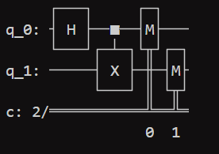
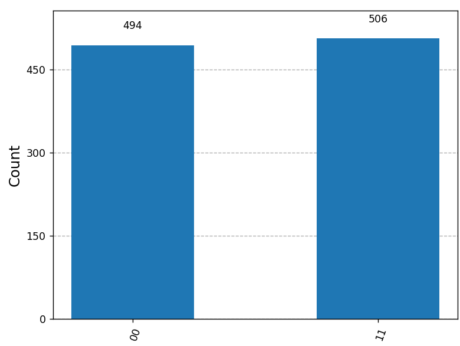
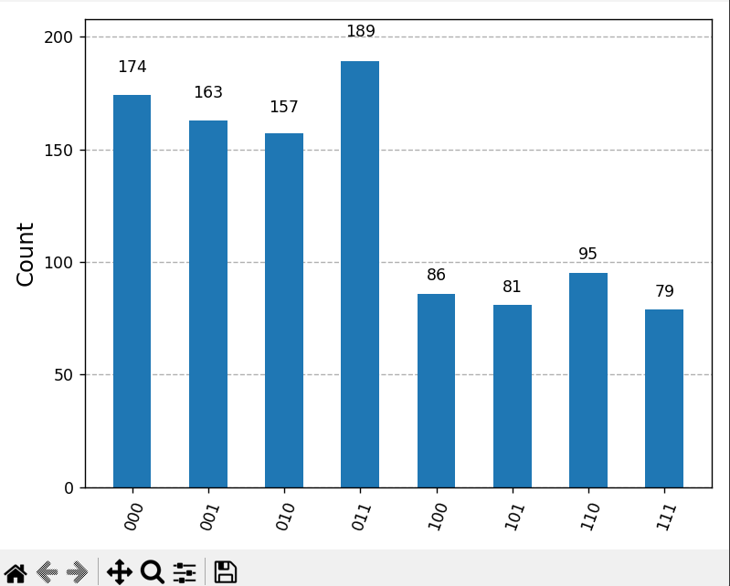
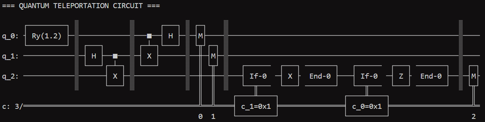
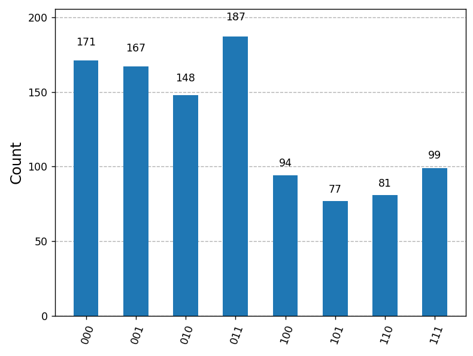
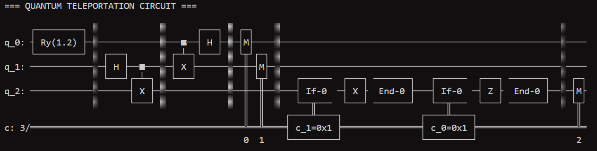
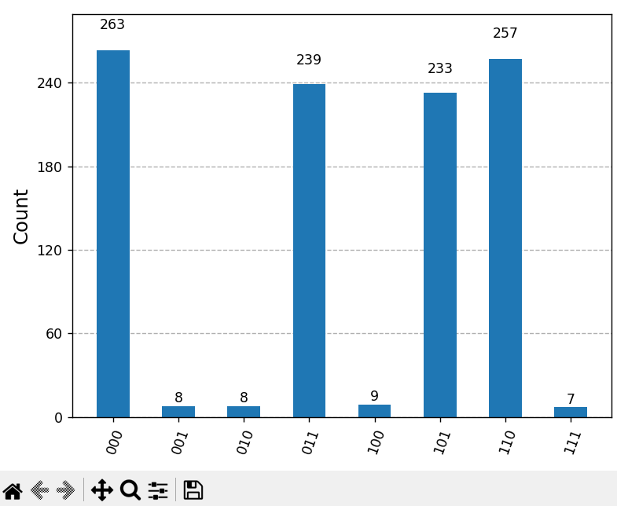
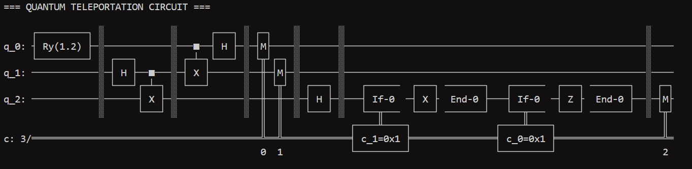
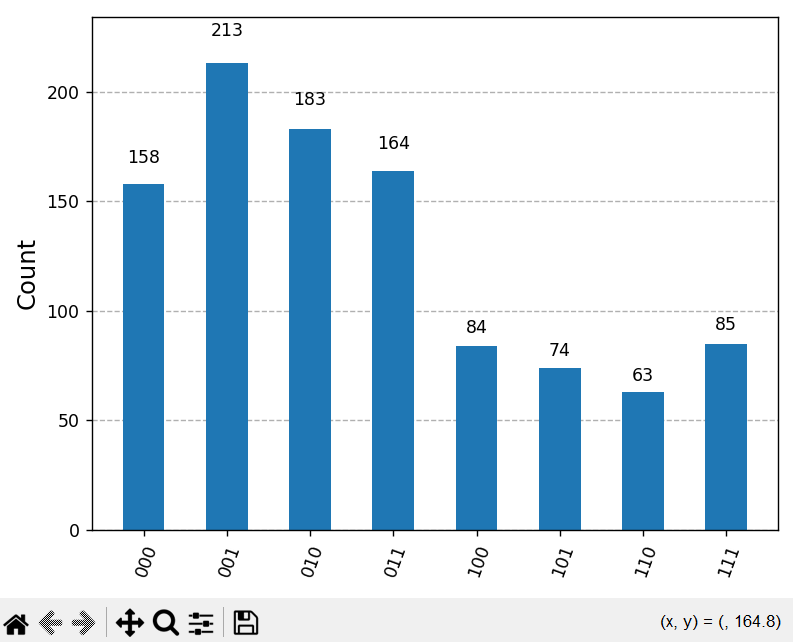
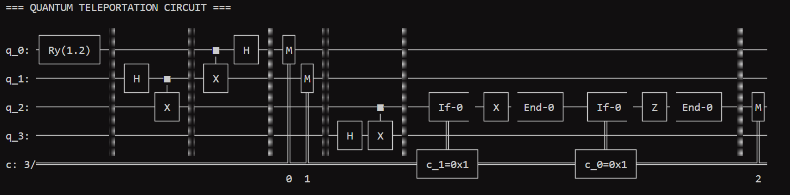

# FOUNDATIONAL EXPERIMENT: Bell State Entanglement

### Objective
Demonstrate the creation of a Bell state and verify quantum entanglement using measurement statistics.

---

### Setup
- 2-qubit quantum circuit
- Hadamard gate applied to qubit 0
- CNOT gate applied between qubit 0 and qubit 1
- Qiskit Aer simulator
- 1000 measurement shots

---

## Quantum Circuit

---
### Histogram

## Measurement Results

Measurement Results:
{'11': 478, '00': 522}

---
---
## EXPERIMENT 1: Baseline Teleportation

### Objective
Verify teleportation works in an ideal simulator.

---

### Setup
- Qiskit Aer simulator
- 3-qubit quantum teleportation circuit
- 1024 measurement shots

---

### State Prepared
Ry(1.2)|0⟩

---

## Results

---

### Statevector (Post-Circuit Evolution)

Statevector([ 0.41266781+0.j,  0.41266781+0.j,  0.28232124+0.j,
             -0.28232124+0.j,  0.28232124+0.j, -0.28232124+0.j,
              0.41266781+0.j,  0.41266781+0.j],
            dims=(2, 2, 2))

This represents the full quantum state of the 3-qubit system before measurement collapse.

---

### Measurement Results

State 000 : 174 counts | Probability = 0.1699  
State 001 : 163 counts | Probability = 0.1592  
State 010 : 157 counts | Probability = 0.1533  
State 011 : 189 counts | Probability = 0.1846  
State 100 : 86 counts | Probability = 0.0840  
State 101 : 81 counts | Probability = 0.0791  
State 110 : 95 counts | Probability = 0.0928  
State 111 : 79 counts | Probability = 0.0771  

---

### Harsh Qubit Analysis

Harsh measured 0 : 683 times | Probability = 0.6670  
Harsh measured 1 : 341 times | Probability = 0.3330  

---

### Observation

This approximates the original prepared state Ry(1.2)|0⟩, indicating successful teleportation in a noiseless simulator. Harsh's qubit represents the teleported state after classical correction.

---

### Result Summary

- P(0) ≈ 0.66  
- P(1) ≈ 0.33  

---

---
# EXPERIMENT 2: Noisy Quantum Teleportation

### Objective
Evaluate the robustness of quantum teleportation under depolarizing noise.

---

### Setup
- Qiskit Aer simulator with noise model
- Depolarizing noise applied to single and two qubit gates
- 3-qubit teleportation circuit
- 1024 measurement shots

Noise parameters:
- Single-qubit error rate: 0.02
- Two-qubit error rate: 0.05

---

### State Prepared
Ry(1.2)|0⟩

---

## Results

---

## Statevector (Reference from Noiseless Simulation)

Statevector([ 0.41266781+0.j,  0.41266781+0.j,  0.28232124+0.j,
             -0.28232124+0.j,  0.28232124+0.j, -0.28232124+0.j,
              0.41266781+0.j,  0.41266781+0.j],
            dims=(2, 2, 2))

Note: This represents the ideal noiseless evolution for comparison purposes.

---

## Measurement Results (Noisy Simulation)

State 000 : 176 counts | Probability = 0.1719  
State 001 : 161 counts | Probability = 0.1572  
State 010 : 169 counts | Probability = 0.1650  
State 011 : 169 counts | Probability = 0.1650  
State 100 : 75 counts | Probability = 0.0732  
State 101 : 83 counts | Probability = 0.0811  
State 110 : 95 counts | Probability = 0.0928  
State 111 : 96 counts | Probability = 0.0938  

---

## Harsh Qubit Analysis

Harsh measured 0 : 675 times | Probability = 0.6592  
Harsh measured 1 : 349 times | Probability = 0.3408  

---

## Observation

The introduction of depolarizing noise leads to a noticeable spread in the output distribution. Compared to the baseline experiment, the probability concentration on the expected outcome is reduced, indicating degradation in teleportation fidelity.

---

## Comparison with Experiment 1

- Experiment 1 (Ideal): sharper probability distribution
- Experiment 2 (Noisy): broader distribution with increased randomness

This confirms that quantum teleportation is sensitive to noise and decoherence effects.

---

### Fidelity Discussion

F = |⟨ψ|φ⟩|²

---

---
# EXPERIMENT 3: Pratap Hadamard Disturbance Attack

### Objective
Evaluate the impact of malicious interference on quantum teleportation fidelity.

---

### Setup
- Same teleportation circuit as Experiment 1
- A Hadamard disturbance gate was introduced by Pratap before receiver-side correction
- Qiskit Aer simulator
- 1024 measurement shots

---

### Attack Model

Pratap introduced a Hadamard basis disturbance on Harsh's qubit prior to final correction operations.

---

### State Prepared
Ry(1.2)|0⟩

---

## Results

---

## Statevector

Statevector([ 0.41266781+0.j,  0.41266781+0.j,  0.28232124+0.j,
             -0.28232124+0.j,  0.28232124+0.j, -0.28232124+0.j,
              0.41266781+0.j,  0.41266781+0.j],
            dims=(2, 2, 2))

---

## Measurement Results

State 000 : 263 counts | Probability = 0.2568  
State 001 : 8 counts | Probability = 0.0078  
State 010 : 8 counts | Probability = 0.0078  
State 011 : 239 counts | Probability = 0.2334  
State 100 : 9 counts | Probability = 0.0088  
State 101 : 233 counts | Probability = 0.2275  
State 110 : 257 counts | Probability = 0.2510  
State 111 : 7 counts | Probability = 0.0068  

---

## Harsh Qubit Analysis

Harsh measured 0 : 518 times | Probability = 0.5059  
Harsh measured 1 : 506 times | Probability = 0.4941  

---

## Observation

The Hadamard disturbance significantly altered the receiver output distribution. Unlike the ideal teleportation experiment, the receiver probabilities became nearly uniform, indicating severe degradation of teleportation fidelity.

---

## Security Interpretation

Quantum teleportation is highly sensitive to basis disturbances introduced during transmission. Unauthorized interference produces statistically observable corruption in the reconstructed quantum state, making interception attempts detectable.

---

---
# EXPERIMENT 4: Entanglement Injection Attack

### Objective
Study the impact of malicious entanglement injection on the teleportation process.

---

### Setup
- 4-qubit teleportation circuit
- Additional attacker qubit introduced
- Pratap entangles an external qubit with Harsh's receiver qubit
- Qiskit Aer simulator
- 1024 measurement shots

---

### Attack Model

Pratap introduced an additional qubit and created entanglement using a Hadamard gate followed by a CNOT operation targeting Harsh's qubit.

Attack operations:
- H gate on attacker qubit
- CNOT(attacker → receiver)

---

### State Prepared
Ry(1.2)|0⟩

---

## Results

---

## Statevector

Statevector([ 0.29180021+0.j,  0.29180021+0.j,  0.19963126+0.j,
             -0.19963126+0.j,  0.19963126+0.j, -0.19963126+0.j,
              0.29180021+0.j,  0.29180021+0.j,  0.29180021+0.j,
              0.29180021+0.j,  0.19963126+0.j, -0.19963126+0.j,
              0.19963126+0.j, -0.19963126+0.j,  0.29180021+0.j,
              0.29180021+0.j],
            dims=(2, 2, 2, 2))

---

## Measurement Results

State 000 : 158 counts | Probability = 0.1543  
State 001 : 213 counts | Probability = 0.2080  
State 010 : 183 counts | Probability = 0.1787  
State 011 : 164 counts | Probability = 0.1602  
State 100 : 84 counts | Probability = 0.0820  
State 101 : 74 counts | Probability = 0.0723  
State 110 : 63 counts | Probability = 0.0615  
State 111 : 85 counts | Probability = 0.0830  

---

## Harsh Qubit Analysis

Harsh measured 0 : 718 times | Probability = 0.7012  
Harsh measured 1 : 306 times | Probability = 0.2988  

---

## Observation

The injected entanglement altered the receiver probability distribution and modified the reconstructed quantum state. Compared to Experiment 1, the statistical behavior of Harsh's qubit changed noticeably due to external interaction.

---

## Security Interpretation

Entanglement injection demonstrates how an attacker may interfere with quantum communication channels without directly measuring the transmitted qubit. The experiment highlights the importance of secure entanglement management in quantum communication systems.

---